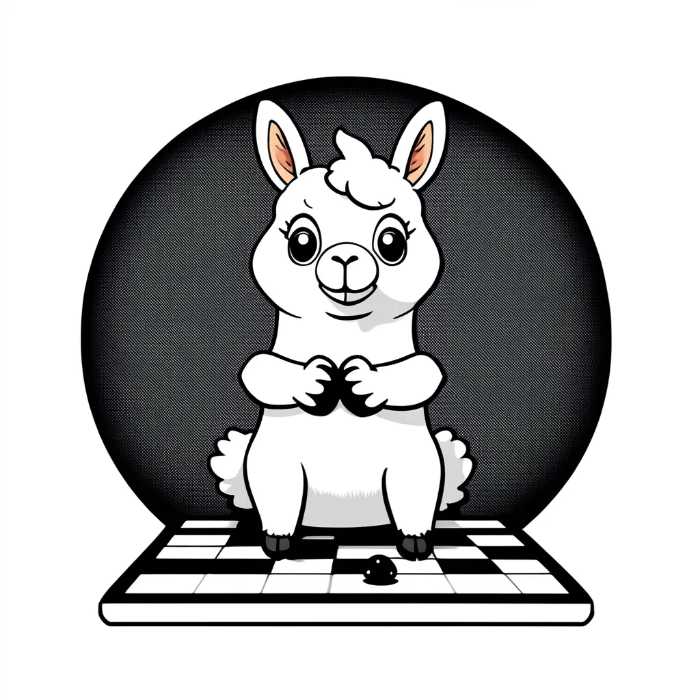
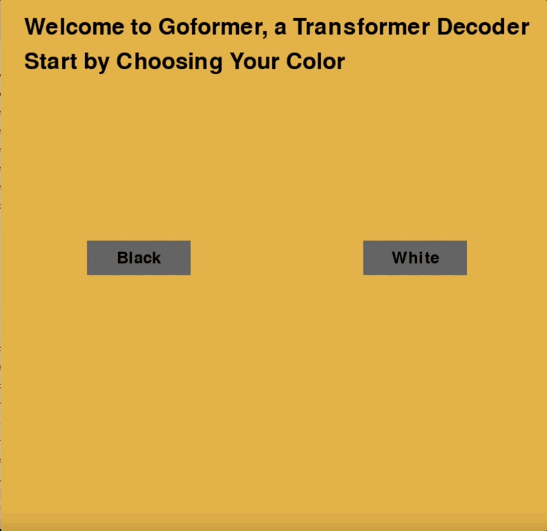

# GoFormer - Language Model That Plays Go
Before AlphaGo[1], Go was considered a game that was too complex for AI to master.
In 2017, AlphaGo[1] and AlphaZero[2] defeated a Go Champion, with policy network, value network, and Monte Carlo Tree Search (MCTS)[3][4] that looks ahead. MCTS is a decisive factor contributing to the world champion level performance.
With the recent advancement of large language model in transformer[5] based decoder with a next token prediction objective[6], and it's application in Chess[7][8], how does a language model (the GoFormer here) perform in a Go game?
[9] finetunes 124M, 355M, and 744M GPT-2[10] on 56,638 Go game. To the best of the knowledge, this is the first time a language model is trained from scratch with 1.36M Go games.


Can GoFormer perform reasonably well just by next move (token) prediction, without MCTS[3][4]? Let's find out.
My research goals are that:
- if language model can reason and plan, it can play Go very well.
- if GoFormer can perform reasonably well, it can be used as a baseline for future research in Go game, without the use of tree search.
- does language model needs MCTS to play Go well?
- Go game is a game of reasoning and planning, and it is a good testbed for language model because result is measurable. Model architecture can be tested and compared.

## GoFormer Model
The first version of model is in Huggingface 🤗[kenhktsui/goformer-v0.1](https://huggingface.co/kenhktsui/goformer-v0.1).
The training data, details, design choice are also documented there.
The future plan is to collate more Go data, particularly self play data. It is quite clear that the size of the existing data is quite trivial compared to modern language model. So it might not work well like MCTS based engine like [Leela Zero](https://github.com/leela-zero/leela-zero).
Please feel free to contribute to the data collection and model training.

## Installation
```shell
pip install -r requirements.txt
```

## Let's play!
```shell
python -m go_transformer.game
```

## Compilation

```shell
# You will need to install pyinstaller
pyinstaller --onefile -w goformer/game.py
```


mouse click on the board to make a move;  
R to resign;  
P to pass.  

## Simulation with [Leela Zero](https://github.com/leela-zero/leela-zero) (Alpha)
1. Installation in MacOS
```shell
brew install leela-zero
```

2. Put your weights in the following directory
```shell
curl --create-dirs -O https://zero.sjeng.org/best-network --output-dir /Users/kentsui/.local/share/leela-zero
````

3. Run the following command
```shell
python -m go_transformer.simulation
```

# Credit
This is my side project, and I am grateful that co-developing with Anthropic Claude 3.5 makes it possible (most of the game.py). I am still amazed by its ability to understand such a long module.

# References
[1] Silver, D., Huang, A., Maddison, C. et al. Mastering the game of Go with deep neural networks and tree search. Nature 529, 484–489 (2016).  
[2] D. Silver, T. Hubert, J. Schrittwieser, I. Antonoglou, M. Lai, A. Guez, M. Lanctot, L. Sifre, D. Kumaran, T. Graepel, et al., “Mastering chess and shogi by self-play with a general reinforcement learning algorithm,” arXiv preprint arXiv:1712.01815, 2017.      
[3] Coulom, R. Efficient selectivity and backup operators in Monte-Carlo tree search. In 5th International Conference on Computer and Games, 72–83 (2006).  
[4] Kocsis, L. & Szepesvari, C. Bandit based Monte-Carlo planning. In ´ 15th European Conference on Machine Learning, 282–293 (2006).    
[5] A. Vaswani, N. Shazeer, N. Parmar, J. Uszkoreit, L. Jones, A. N. Gomez, Ł. Kaiser, and I. Polosukhin. Attention is all you need. In Advances in Neural Information Processing Systems, pages 6000–6010, 2017.  
[6] Radford, Alec and Karthik Narasimhan. “Improving Language Understanding by Generative Pre-Training.” (2018).  
[7] D. Noever, M. Ciolino, and J. Kalin. The Chess Transformer: Mastering Play using Generative Language Models, Sept. 2020.  
[8] Zhang, Edwin et al. “Transcendence: Generative Models Can Outperform The Experts That Train Them.” (2024).  
[9] Ciolino, Matthew et al. “The Go Transformer: Natural Language Modeling for Game Play.” 2020 Third International Conference on Artificial Intelligence for Industries (AI4I) (2020): 23-26.  
[10]  Radford, Alec et al. “Language Models are Unsupervised Multitask Learners.” (2019).
